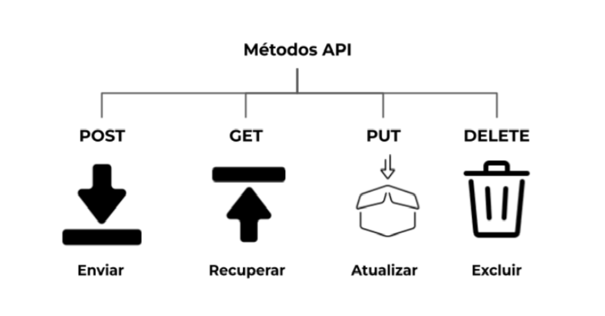

1. [¿Para qué usamos Clases en Python?](#para-qué-usamos-clases-en-python)
2. [¿Qué método se ejecuta automáticamente cuando se crea una instancia de una clase?](#qué-método-se-ejecuta-automáticamente-cuando-se-crea-una-instancia-de-una-clase)
3. [¿Cuáles son los tres verbos de API?](#cuáles-son-los-tres-verbos-de-api)
4. [¿Es MongoDB una base de datos SQL o NoSQL?](#es-mongodb-una-base-de-datos-sql-o-nosql)
5. [¿Qué es una API?](#qué-es-una-api)
6. [¿Qué es Postman?](#qué-es-postman)
7. [¿Qué es el polimorfismo?](#qué-es-el-polimorfismo)
8. [¿Qué es un método dunder?](#qué-es-un-método-dunder)
9. [¿Qué es un decorador de Python?](#qué-es-un-decorador-de-python)
#
# ¿Para qué usamos Clases en Python?
&#128204; **Clase** es una plantilla (esquema) para crear objetos que combinan datos (variables) y comportamiento (funciones). Se puede decir que una clase es una forma de describir qué es un objeto y cómo debe comportarse.

Imaginemos que estás creando un juego y tienes personajes. Cada personaje tiene un nombre, salud y la capacidad de atacar. En lugar de describir estos datos una y otra vez, creas una clase llamada *"Personaje"* y luego creas diferentes personajes a partir de ella.
# 
&#128204; **Principales razones por las que usamos clases:**
- *Organización del código*. Las clases ayudan a estructurar el código, haciéndolo más legible y lógico.
- *Reutilización*. Una clase se puede usar muchas veces, creando múltiples objetos con la misma estructura pero con datos diferentes.
- *Encapsulación*. Ocultar la lógica interna de un objeto. Por ejemplo, podemos hacer que otras partes del programa no puedan modificar directamente las variables internas del objeto.
- *Simplificación de sistemas complejos*. Las clases permiten combinar datos y comportamiento en un solo objeto, lo que facilita el diseño de programas complejos.
# 
&#128204; **Ejemplo de sintaxis de una clase** en Python:
```
class Person:
    def __init__(self, name, age):
        self.name = name
        self.age = age

    def say_hello(self):
        print(f'¡Hola! Mi nombre es {self.name}, tengo {self.age} años.')
```
*class* - palabra clave para crear una clase.
*\_\_init\_\_()* - método especial que se llama al crear un objeto. Sirve para inicializar (asignar valores iniciales) al objeto y se ejecuta automáticamente cuando se crea.
*self* - referencia al propio objeto. Se usa para acceder a las propiedades y métodos dentro de la clase.
*def()* - métodos (funciones) dentro de la clase. Describen lo que el objeto puede hacer.

Ahora podemos crear un objeto (una instancia de la clase):
```
person1 = Person('Tiana', 35)
person2 = Person('Kira', 10)

person1.say_hello()  # ¡Hola! Mi nombre es Tiana, tengo 35 años.
person2.say_hello()  # ¡Hola! Mi nombre es Kira, tengo 10 años.
```
# 
# ¿Qué método se ejecuta automáticamente cuando se crea una instancia de una clase?
&#128204; Cuando creas una instancia de una clase en el lenguaje de programación Python (es decir, un objeto basado en esa clase), hay un método especial que se llama automáticamente. Este método se llama *\_\_init\_\_*.

**El método \_\_init\_\_** es una función constructora especial y reservada en Python que inicializa (es decir, configura) un nuevo objeto cuando se crea. En otras palabras, cuando creas un objeto, Python llama automáticamente a *\_\_init\_\_*, y puedes usarlo para preparar el objeto para su funcionamiento.
#
&#128204; **Un ejemplo**:
```
class Person:
    def __init__(self, name, age):
        self.name = name
        self.age = age
```
Ahora podemos crear un objeto:
```
person1 = Person('Tiana', 35)  # creando un objeto

print(person1.name)  # Tiana
print(person1.age)  # 35
```
¿Qué ocurre aquí paso a paso?:
Se declara la clase Person.
Dentro de la clase, se define el método *\_\_init\_\_*, que acepta los parámetros(argumentos) name y age.
Cuando se crea el objeto person1, Python llama automáticamente al método *\_\_init\_\_*, pasándole los valores "Tiana" y 35.
Dentro de *\_\_init\_\_*, estos valores se almacenan en el objeto usando self.name y self.age.
#
# ¿Cuáles son los tres verbos de API?
&#128204; Cuando los desarrolladores trabajan con una API (ver la pregunta 5: [¿Qué es una API?](#qué-es-una-api)), a menudo interactúan con los datos mediante solicitudes HTTP. Estas solicitudes utilizan "verbos" especiales (métodos) para indicarle al servidor qué se debe hacer con los datos.

Los verbos de API más utilizados son:
- **POST** – crea / escribe nuevos datos. Envía datos al servidor para crear un nuevo objeto.
- **GET** – solicita / obtiene datos. Obtiene información del servidor. No modifica los datos, solo los lee.
- **PUT** – actualiza / sobrescribe datos. Actualiza completamente un objeto existente.

También existen otros métodos HTTP, como **DELETE**, que elimina el objeto especificado del servidor.

Comprender estos verbos es fundamental al trabajar con cualquier API. Es como el “lenguaje” de comunicación entre el cliente (tu aplicación) y el servidor.
#
# ¿Es MongoDB una base de datos SQL o NoSQL?
&#128204; Cuando comienzas a estudiar bases de datos, te encuentras con dos términos principales:
- **SQL** - lenguaje estructurado de consultas, utilizado en bases de datos relacionales tradicionales para trabajar con tablas que contienen filas y columnas (Ejemplos: MySQL, PostgreSQL, Oracle, SQL Server).
- **NoSQL** - un enfoque más flexible para almacenar datos. Las bases de datos NoSQL no utilizan tablas. Los datos se almacenan en forma de documentos o colecciones (Ejemplos: MongoDB, Cassandra, Redis, CouchDB).
#
&#128204; **MongoDB es una base de datos NoSQL** orientada a documentos. En lugar de tablas y filas, MongoDB utiliza datos flexibles y no estructurados.  
      
**Estructura de MongoDB:**
- *Base de datos* → contiene una o varias colecciones
- *Colección* → contiene muchos documentos
- *Documento* → es un registro individual en formato JSON  
     
**Ejemplo de un documento en MongoDB:**
```
{
  "name": "Tiana",
  "age": 35,
  "email": "tiana@example.com"
}
```
#
&#128204; Para trabajar con MongoDB en Python, necesitaremos la biblioteca ```pymongo```.  
Instala la biblioteca ejecutando el comando:
```
pip install pymongo
```
- [Documentación de MongoDB](https://www.mongodb.com/docs/)
#
# ¿Qué es una API?
&#128204; Cuando comienzas a trabajar con programación, a menudo escuchas la palabra API. **API (Application Programming Interface)** es un conjunto de reglas que permite que diferentes programas y servicios se comuniquen entre sí. Define cómo deben interactuar los componentes de un sistema, cómo deben intercambiar datos y ejecutar acciones.

Imagina que quieres pedir un taxi a través de una aplicación en tu teléfono.
Esa aplicación no controla directamente los taxis, sino que utiliza una API para enviar una solicitud al servidor de la empresa de taxis. El servidor procesa la solicitud, encuentra el taxi más cercano y te envía una respuesta con la información del vehículo y el tiempo estimado de llegada.
#
&#128204; Cuando usas una API, envías una solicitud desde el cliente (por ejemplo, tu aplicación) hacia un servidor, el cual procesa la solicitud y te envía una respuesta. Esta interacción puede realizarse en diferentes formatos, como JSON, XML u otros.

**Esquema de funcionamiento de una API:**
- *Solicitud*: El cliente (tu aplicación) envía una solicitud al servidor a través de la API.
- *Procesamiento*: El servidor recibe la solicitud, ejecuta las acciones necesarias y genera una respuesta.
- *Respuesta*: El servidor envía una respuesta al cliente. Esta puede ser, por ejemplo, una lista de datos, un mensaje de estado o un error.
#
&#128204; Las API pueden clasificarse según diferentes criterios. Aquí tienes los principales tipos de API:
1. **API abiertas (Open APIs)**  
Son APIs públicas, disponibles para que cualquiera las utilice. Ofrecen posibilidades de integración con diversas aplicaciones y servicios.  
Ejemplo: *Twitter API, Google Maps API, OpenWeather API*.
2. **API privadas (Private APIs)**  
Están destinadas al uso interno dentro de una empresa u organización. Permiten que distintos sistemas y componentes se comuniquen entre sí internamente.  
Ejemplo: *APIs internas para la comunicación entre microservicios dentro de una empresa*.
3. **API de socios (Partner APIs)**  
Estas APIs están disponibles solo para un grupo limitado de desarrolladores o socios. Normalmente requieren una clave de API u otro método de autenticación.  
Ejemplo: *PayPal API para integrarse con servicios de pago, accesible solo para socios autorizados*.
4. **API compuestas (Composite APIs)**  
Permiten combinar múltiples fuentes de datos en una sola solicitud. Son útiles cuando se necesita obtener información de varios sistemas o servicios al mismo tiempo.  
Ejemplo: *Solicitar al mismo tiempo datos del usuario, pedidos y pagos desde distintos microservicios*.
5. **API RESTful (REST APIs)**  
REST (Representational State Transfer) es un estilo arquitectónico para el desarrollo de aplicaciones web. Las APIs RESTful utilizan solicitudes HTTP (GET, POST, PUT, DELETE) y se centran en recursos representados por URLs.  
Ejemplo: *Google Maps API, GitHub API*.
6. **API SOAP (Simple Object Access Protocol)**  
SOAP es un protocolo para el intercambio de mensajes estructurados. Utiliza XML para enviar datos y puede operar sobre HTTP, SMTP u otros protocolos.  
Ejemplo: *APIs bancarias o corporativas que requieren alta seguridad y fiabilidad*.
7. **API GraphQL**  
GraphQL es un lenguaje de consultas que permite a los clientes solicitar solo los datos que necesitan, evitando el exceso de información. Ofrece una alternativa más flexible que REST.  
Ejemplo: *GitHub GraphQL API*.
8. **API WebSocket**  
Permite establecer una comunicación bidireccional en tiempo real entre cliente y servidor. Es especialmente útil para aplicaciones que requieren intercambio de datos en tiempo real, como chats o juegos en línea.  
Ejemplo: *Chats o plataformas de comercio en tiempo real*.

Cada tipo de API tiene sus propias características y se utiliza en distintos contextos, según las necesidades y requisitos del proyecto.
#
&#128204; Para trabajar con APIs en Python, se utiliza frecuentemente la biblioteca ```requests```.  
Puedes instalarla con el siguiente comando:
```
pip install requests
```
#
# ¿Qué es Postman?


# ¿Qué es el polimorfismo?

# ¿Qué es un método dunder?

# ¿Qué es un decorador de Python?
